# GoodHealthMate Food Recognition Service

This folder contains the Python / FastAPI food recognition service used by GoodHealthMate. It receives a food image from the app flow, runs a ResNet-50 image classifier, returns the top food prediction with alternatives, and enriches the top result with nutrition data where available.

## Food Recognition Flow

The mobile app should call the main Node / Express backend first. The backend then proxies the request to this FastAPI service with a server-side token, so the recognition service is not exposed directly to the app client.

```mermaid
flowchart LR
  user["User"]
  phone["Phone food scan screen<br/>React Native / Expo"]
  backend["Node / Express backend<br/>/api/food-recognition"]
  guard["FastAPI request guard<br/>shared token, CORS,<br/>rate limit, file checks"]
  preprocess["Image preprocessing<br/>RGB, resize 256,<br/>center crop 224, normalize"]
  model["ResNet-50 classifier<br/>ONNX Runtime preferred<br/>PyTorch fallback"]
  topk["Top-5 predictions<br/>softmax confidence scores"]
  ood["Confidence guard<br/>OOD and ambiguous-food checks"]
  nutrition["USDA FoodData Central<br/>nutrition lookup for top class"]
  response["Prediction JSON<br/>top result, alternatives,<br/>warning, nutrition"]
  feedback["Correction feedback<br/>predicted class, correct class,<br/>optional image"]
  store[("Feedback store<br/>images + log.jsonl")]

  user -->|"takes or uploads food photo"| phone
  phone -->|"multipart image request"| backend
  backend -->|"server-token request"| guard
  guard --> preprocess
  preprocess --> model
  model --> topk
  topk --> ood
  topk --> nutrition
  ood --> response
  nutrition --> response
  response -->|"stable API payload"| backend
  backend -->|"scan result for the UI"| phone
  phone -->|"user says prediction is wrong"| feedback
  feedback --> store
  store -->|"future monthly harvest / retraining input"| model
```



Request contract:

1. The user scans or uploads a food image from the mobile app.
2. The Node / Express backend forwards the image to this service with `x-food-api-token` and a per-user `x-food-client-key`.
3. FastAPI validates the token, rate limit, file type, and file size before touching the model.
4. The predictor converts the image into the same tensor shape used during validation: RGB, resize shortest side to 256, centre crop 224, ImageNet normalisation, and NCHW layout.
5. The model returns top-5 food classes and confidence scores.
6. The service flags low-confidence or visually ambiguous predictions and enriches the top class with USDA nutrition data.
7. The backend receives predictable JSON and sends the result back to the phone UI.

## What This Service Does

- Serves food image classification through FastAPI.
- Loads the exported ONNX model first for faster CPU inference.
- Falls back to the PyTorch checkpoint when ONNX is unavailable during local development.
- Returns a top prediction plus four alternatives so the UI can display uncertainty clearly.
- Applies out-of-distribution checks for low-confidence images and known ambiguous food groups.
- Looks up calories and macro nutrients for the top predicted class through USDA FoodData Central.
- Records user correction feedback for future dataset improvement and regression testing.

## Runtime API Surface

| Method | Endpoint | Auth | Purpose |
| --- | --- | --- | --- |
| `GET` | `/health` | Public | Confirms the API is alive and whether the model is loaded. |
| `POST` | `/predict` | Required | Accepts a food image and returns top-5 predictions plus nutrition for the top class. |
| `POST` | `/feedback` | Required | Stores a user correction with the predicted class, correct class, and optional image. |
| `GET` | `/classes` | Required | Lists the active food class names from `data/splits/phase3_classes.json`. |
| `GET` | `/feedback/export` | Required | Admin export of feedback images and `log.jsonl` for retraining harvests. |

Protected routes accept either:

- `x-food-api-token: <token>`
- `Authorization: Bearer <token>`

The backend should also forward `x-food-client-key` so rate limiting is applied per app user rather than to the shared backend IP.

## Model And Inference Pipeline

The runtime path is implemented in [api/predictor.py](api/predictor.py) and [api/main.py](api/main.py).

- Active class map: `data/splits/phase3_classes.json`
- Active ONNX model: `models/checkpoints/resnet50_extended.onnx`
- ONNX external weights: `models/checkpoints/resnet50_extended.onnx.data`
- PyTorch fallback checkpoint: `models/checkpoints/phase3_resnet50_best.pth`
- Model family: ResNet-50 extended classifier
- Output: top-5 `(class_name, confidence)` predictions
- Optional robustness mode: set `FOOD_RECOGNITION_TTA=1` to average the original image and horizontal flip

Current repository snapshot:

- The Phase 3 class map contains 187 supported food classes.
- `evaluate/gate_baseline.json` records a Phase 3.5 lab validation accuracy of 94.6%.
- `evaluate/calibration_phase3.5.json` records 94.54% calibration-set accuracy and an expected calibration error improvement from 0.0886 to 0.0159 after temperature scaling.

## Out-Of-Distribution Handling

The service does not pretend every image is confidently recognised. [api/ood_detector.py](api/ood_detector.py) uses softmax confidence thresholds to flag uncertain scans.

- Default low-confidence threshold: `0.75`
- Ambiguous food threshold: `0.60`
- Ambiguous groups include examples such as similar meat cuts, citrus fruits, apple/pear, and dark berries.

When a result is uncertain, the API still returns the best prediction and alternatives, but includes `ood_detected: true` and a user-facing warning message.

## Nutrition Enrichment

The active prediction endpoint uses [api/usda_client.py](api/usda_client.py). It searches USDA FoodData Central for the top predicted class and returns available nutrition fields:

- calories
- protein
- carbohydrates
- fat
- fibre
- serving description

Nutrition results are cached in memory for 24 hours. If `USDA_API_KEY` is missing or the lookup fails, the prediction still succeeds and nutrition is returned as `null`.

There is also a legacy FatSecret client in [api/fatsecret_client.py](api/fatsecret_client.py), but the current `/predict` route calls USDA.

## Security And Reliability Controls

- Shared API token required for `/predict`, `/feedback`, `/classes`, and `/feedback/export`.
- Constant-time token comparison through `hmac.compare_digest`.
- Per-route rate limiting with a default of 60 requests per minute.
- Backend-forwarded `x-food-client-key` support so legitimate users do not share one backend bucket.
- File type allowlist: JPEG, JPG, PNG, and WebP.
- Prediction upload limit: 10 MB.
- Feedback image upload limit: 6 MB.
- CORS origin allowlist through `FOOD_RECOGNITION_ALLOWED_ORIGINS`.
- Model warm-up during FastAPI lifespan startup.

## Local Development

From the repository root:

```powershell
cd food_recognition
python -m venv venv
.\venv\Scripts\Activate.ps1
pip install -r requirements.txt
python -m uvicorn api.main:app --host 0.0.0.0 --port 8000
```

Health check:

```powershell
curl.exe http://localhost:8000/health
```

Prediction request:

```powershell
curl.exe -X POST http://localhost:8000/predict `
  -H "x-food-api-token: $env:FOOD_RECOGNITION_API_TOKEN" `
  -H "x-food-client-key: local-user" `
  -F "file=@sample-food.jpg"
```

## Docker

The Docker image runs the FastAPI app on port `8000`.

```bash
cd food_recognition
docker build -t goodhealthmate-food-recognition .
docker run --env-file .env -p 8000:8000 goodhealthmate-food-recognition
```

## Environment Variables

| Variable | Required | Purpose |
| --- | --- | --- |
| `FOOD_RECOGNITION_API_TOKEN` | Yes for protected routes | Shared server token used by the backend proxy. |
| `FOOD_RECOGNITION_ALLOWED_ORIGINS` | Production recommended | Comma-separated CORS allowlist. |
| `FOOD_RECOGNITION_RATE_LIMIT_MAX` | No | Per-minute protected-route limit. Defaults to `60`; set `0` to disable. |
| `FOOD_RECOGNITION_TTA` | No | Enables test-time augmentation when set to `1`, `true`, `yes`, or `on`. |
| `USDA_API_KEY` | Recommended | Enables nutrition lookup through USDA FoodData Central. |
| `FEEDBACK_DIR` | Production recommended | Feedback storage root. Defaults to `/data/feedback`. |
| `PORT` | Hosted runtime | Port used when running `api/main.py` directly. Defaults to `8000`. |
| `FATSECRET_CLIENT_ID` | Legacy only | Used by the older FatSecret client, not by the active `/predict` route. |
| `FATSECRET_CLIENT_SECRET` | Legacy only | Used by the older FatSecret client, not by the active `/predict` route. |

## Project Structure

```text
food_recognition/
  api/                 FastAPI app, schemas, predictor, nutrition clients, feedback storage
  models/              ResNet-50 definitions, ONNX export scripts, checkpoints
  data/                Dataset preparation, class splits, feedback harvest scripts
  train/               Training datasets, transforms, training phases, utilities
  evaluate/            Evaluation, calibration, regression gates, real-world checks
  charts/              Plotting utilities for results and reports
  training_result/     Historical training logs
  validatation_result/ Historical validation logs
  test_result/         Real-world and background-shift test outputs
  Dockerfile           Container runtime for the API service
  requirements.txt     Python dependencies for local development and training
```

## How It Fits Into GoodHealthMate

The food recognition service is intentionally separate from the main backend. That keeps model loading, image processing, and ML dependencies out of the Node / Express API while still giving the mobile app one stable backend contract. In production, the app talks to the backend; the backend talks to FastAPI; FastAPI returns structured predictions that the app can turn into food logs, nutrition context, or correction feedback.
